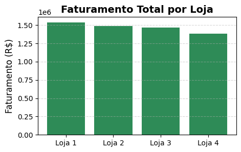
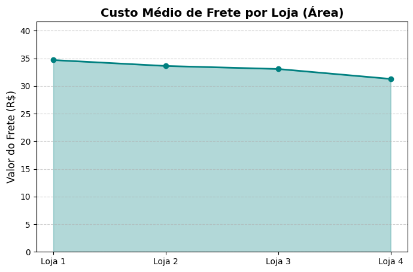
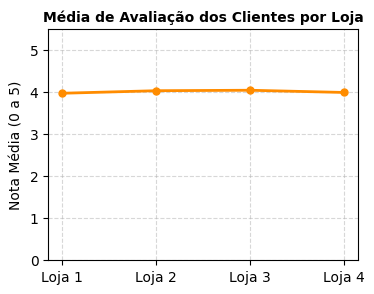
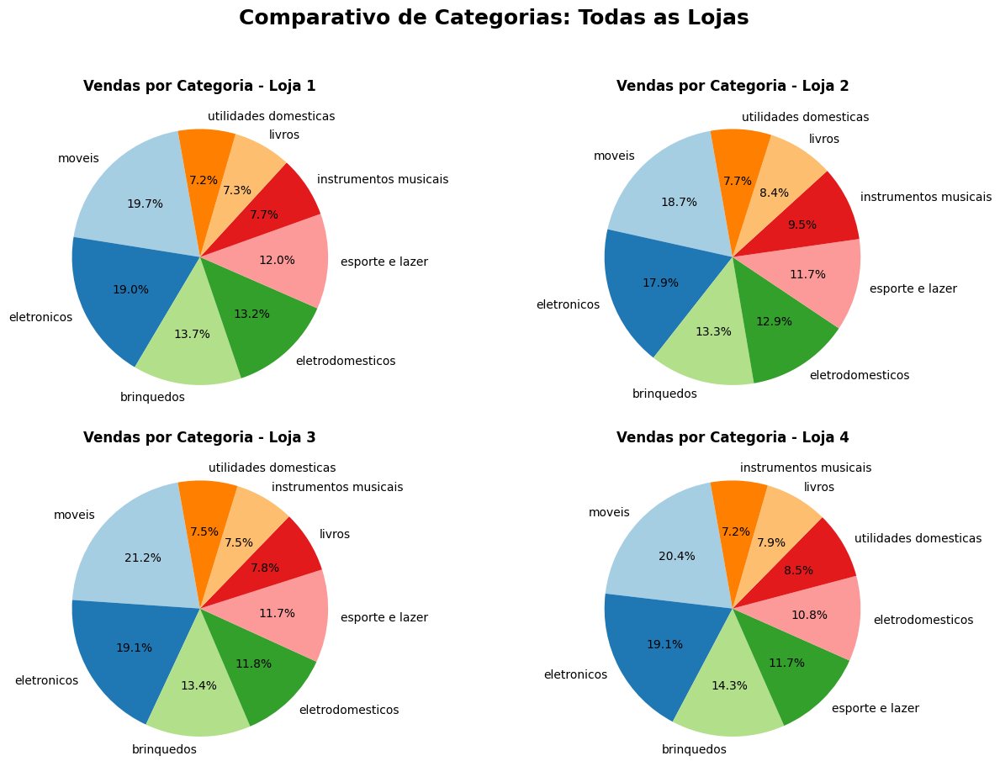
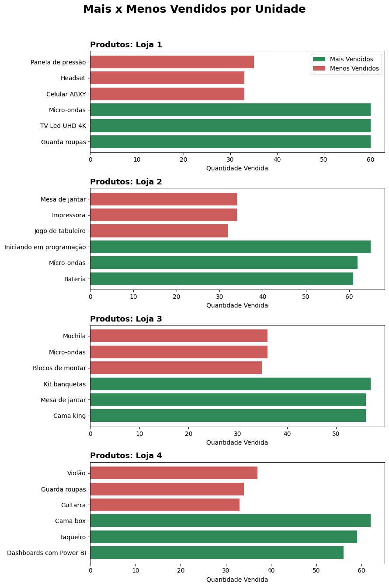

<h1 align="center"> Challenge: Alura Store </h1>

# Índice
* [Titulo](#titulo)
* [Índice](#indice)
* [Descrição do Projeto](#descrição-do-projeto)
* [Objetivos](#objetivos)
* [Visualizações Geradas](#visualizaç0es-geradas)
* [Tecnologias Utilizazdas](#tecnologias-utilizadas)
* [Como executar o projeto](#como-executar-o-projeto)
* [Conclusão da Análise](#conclusao-da-analise)

## Descrição do Projeto
Este projeto foi desenvolvido para resolver um problema de negócio: o Senhor João, dono de uma rede com 4 lojas, precisa decidir qual unidade deve ser vendida para otimizar seus investimentos. 

Através da análise de dados de vendas (arquivos CSV), extraímos insights sobre faturamento, logística, satisfação do cliente e giro de estoque para fundamentar essa decisão de forma técnica e objetiva.

## Objetivos
* Identificar a loja com maior e menor faturamento.
* Analisar o custo médio de frete por unidade.
* Avaliar a satisfação dos clientes através das notas de compra.
* Mapear os produtos de maiores vendas e os itens com o estoque parado.

## Visualizações Geradas
O projeto conta com diversos tipos de gráficos para diferentes necessidades:

  
  

  

  
## Tecnologias Utilizadas
* **Python**: Linguagem principal.
* **Pandas**: Manipulação e tratamento dos dados.
* **Matplotlib**: Criação de visualizações e dashboards.
* **Google Colab**: Ambiente de desenvolvimento.

## Como executar o projeto
1. Clone o repositório.
2. Abra o arquivo `AluraStoreBrasil.ipynb` no Google Colab ou Jupyter Notebook.
3. Certifique-se de ter as bibliotecas `pandas` e `matplotlib` instaladas.
4. Execute as células para visualizar os gráficos e o relatório final.

## Conclusão da Análise
Com base nos dados, a recomendação final foi a **venda da Loja 4**. 
**Justificativa:** A unidade apresenta o menor faturamento da rede e baixa aceitação de mercado, mesmo possuindo o frete mais barato do grupo. Isso indica que o problema é a falta de demanda regional e não o custo operacional.

